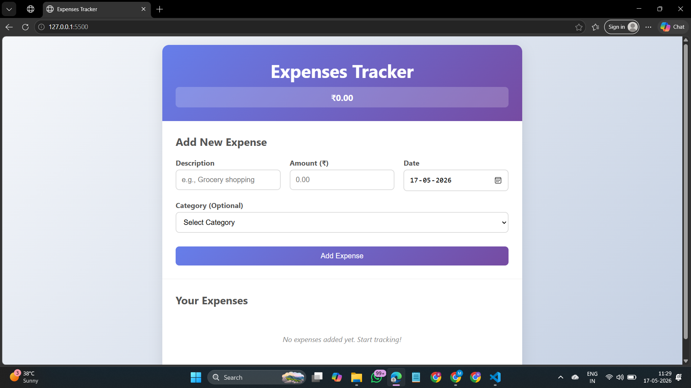
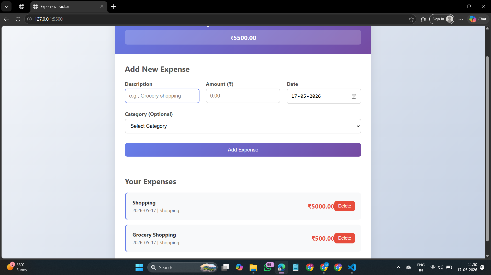

# Expenses-Tracker-
A simple and responsive Expense Tracker website built using HTML, CSS, and JavaScript.
This project helps users to add, manage, and track their daily expenses easily.

Features
Add income and expenses
View balance updates instantly
Simple and clean UI
Responsive design
Built with pure HTML, CSS, and JavaScript
Technologies Used
HTML5
CSS3
JavaScript
Project Purpose

This project was created to improve frontend development skills and practice DOM manipulation using JavaScript.

Future Improvements
Add local storage support
Expense categories
Charts and analytics
Dark mode

## Output Screenshots

Author
Made by Nitish Narule 

